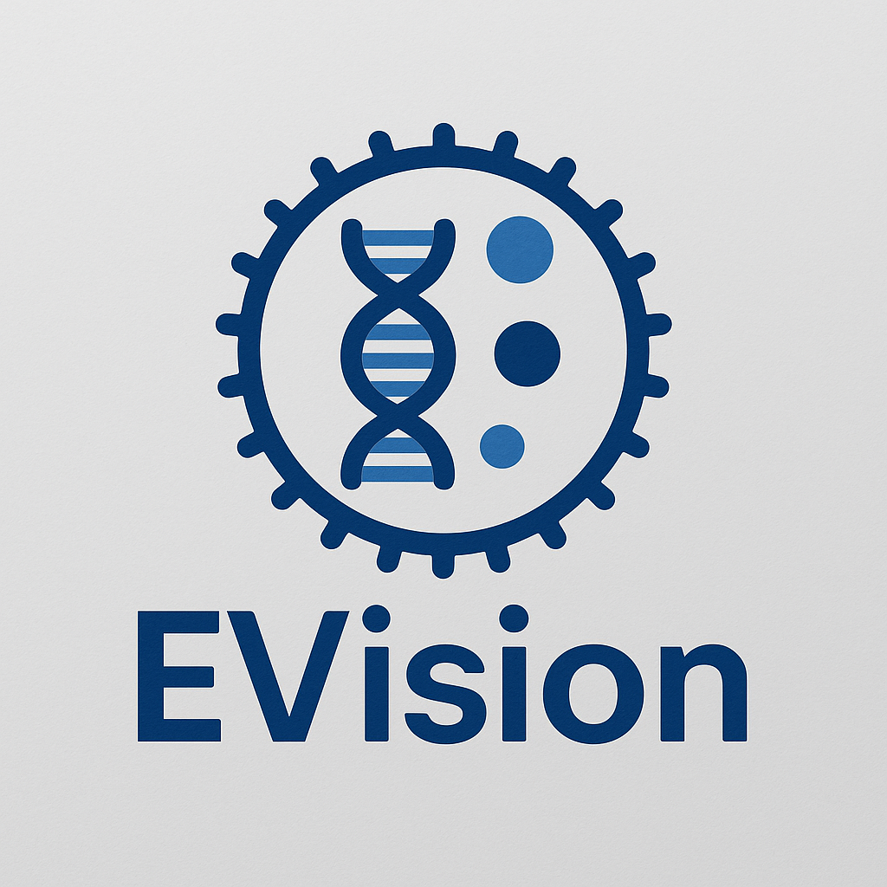

  

# 📦 EVision: Extracellular Vesicle Bioinformatics Pipeline

*A lightweight, modular pipeline for processing, analyzing, and visualizing extracellular vesicle (EV) cargo datasets from Vesiclepedia. (other sources are being explored)*

## 🌟 Overview

EVision is a Python based pipeline designed to streamline the extraction, transformation, and analysis of extracellular vesicle (EV) molecular cargo data from Vesiclepedia.
It allows researchers to easily:

* Parse Vesiclepedia export files

* Map identifiers (gene symbols, UniProt, Entrez IDs)

* Generate GMT pathway style files

* Perform enrichment-ready analyses

* Visualize EV protein/RNA distributions

* Build reproducible, modular EV data workflows

The pipeline is intentionally designed to be lightweight and does not require raw proteomics files, enabling fast prototyping and downstream integration with multiomics sources such as PRIDE (WIP).

## 🔬 Current Features

### ✅ 1. Vesiclepedia Data Ingestion

* Reads the official Vesiclepedia dataset files
(e.g., VESICLEPEDIA_EXPERIMENT_DETAILS_5.1.txt, VESICLEPEDIA_PROTEIN_MRNA_DETAILS_5.1.txt)

* Automatically detects delimiter, encoding, and structure

* Cleans and normalizes field names for downstream analysis

### ✅ 2. Gene Identifier Normalization

* Converts Vesiclepedia identifiers into unified gene symbols

* Uses mygene.info API for robust symbol ↔ Entrez mapping

* Handles missing IDs, synonyms, outdated names

### ✅ 3. GMT Database Generation

* Creates a Vesiclepedia.gmt file representing:

* One line per experiment

* One gene set per EV study

* Fully compatible with GSEA, Enrichr, fgsea, and downstream enrichment workflows

Automatically handles:

* Duplicate genes

* Missing annotations

* Multiple species (human-only by default)

### ✅ 4. EV Gene/Protein Analysis

The pipeline currently supports:

* Frequency analysis of EV cargo

* Distribution summaries across experiments

* Dataset-wide gene/protein plots

* Disease or sample-type filtering (if present in metadata)

### ✅ 5. Reproducible File Structure

## 🧬 Future Roadmap

This repository is designed to expand into a full EV multi-omics pipeline, including:

### 🔵 PRIDE Integration (Upcoming)

* Automated discovery of EV-related PRIDE (PXD) datasets

* Lightweight download of protein tables (only small metadata, not raw MS files)

* Conversion of PRIDE datasets to GMT format

* Cross-matching PRIDE ↔ Vesiclepedia using PubMed IDs, DOIs, and species/experiment metadata

* Generation of a joint EV gene/protein atlas

### 🟢 Multi-Omics Expansion

* Incorporation of EV RNA, miRNA, lipid, and metabolite layers

* Multi-omics integration (proteome + transcriptome)

* EV-specific network construction

* Pathway and regulatory analysis

### 🔴 Disease-Specific EV Panels (WIP)

* Alzheimer’s EV signatures (CSF, plasma)

* Parkinson’s EV signatures

* Cancer-derived EV signatures

* Cross-dataset comparisons

## 📈 Advanced Visualization (WIP)

* UpSet plots for dataset overlaps

* Heatmaps of EV cargo similarity

* Interactive dashboards (Streamlit / Panel)

## 🚀 Getting Started

1. Clone the repository

`git clone https://github.com/<your-username>/EVision.git`

`cd EVision`

2. Create a virtual environment

`python -m venv venv`

`source venv/bin/activate   # Windows: venv\Scripts\activate`

3. Install dependencies

`pip install -r requirements.txt`

4. Run the Vesiclepedia → GMT converter

`python src/vesiclepedia_converter.py`

This will generate:

`data/vesiclepedia_db.gmt`

5. Explore the example notebook

`jupyter notebook notebooks/EVision_demo.ipynb`

## 📊 Example Output

Generated GMT file

`Experiment_123   Vesiclepedia_Study  APP PSAP CD9 CD81 HSPA8 ...`

`Experiment_124   Vesiclepedia_Study  ALDH1A1 ACTB RAB7A HSP90 ...`

EV Protein Frequency Plot

*WIP*

## 🧠 Why This Pipeline Matters

Extracellular vesicles carry molecular signatures that reflect disease states, cell-type identity, and intercellular communication pathways.
However:

* Vesiclepedia provides curated cargo, not raw or standardized datasets.

* PRIDE provides raw datasets, but they are large and hard to parse.

EVision bridges this gap by providing a fast, reproducible, scriptable pipeline for building EV gene sets and enabling downstream enrichment, comparison, and publication-ready analysis — without requiring heavy proteomics tools.

## 🤝 Contributions

Pull requests, feature requests, and issue reports are welcome!
This project is evolving fast, and community feedback is appreciated.

📄 License

*TBD*